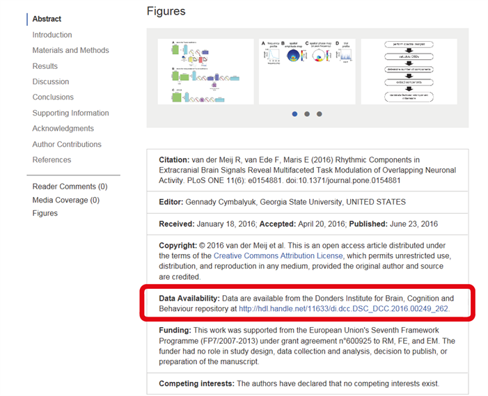
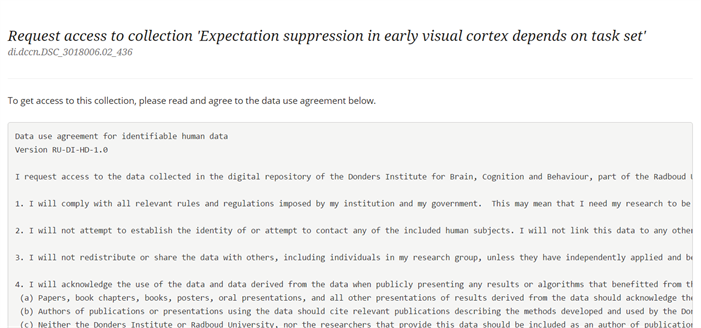
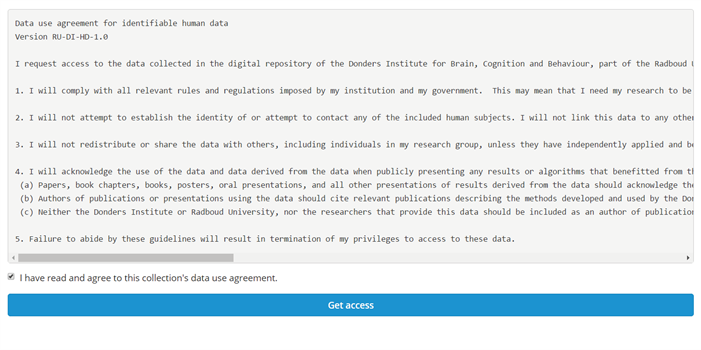

.. _request-access:

Request access
==============

You can find and retrieve shared data in the Donders Research Data Repository through a persistent identifier :ref:`(see this FAQ) <faq-persistent-identifier>` that is specific to the data collection. You can obtain these persistent identifiers in two ways:

1) directly from the author(s) of the data;
2) from a publication that is linked to the data.

For example, say you are interested in the data used in the paper by van der Meij, van Ede and Maris (2016, PLos ONE).You can find the persistent identifier linked to the data on the publication's webpage.

`http://journals.plos.org/plosone/article?d=10.1371/journal.pone.0154881 <http://journals.plos.org/plosone/article?d=10.1371/journal.pone.0154881>`_

In the Donders Research Data Repository, shared data can be found in a :ref:`Data Sharing Collection (DSC) <faq-collection-types>`. Click on the link, which will guide you to the DSC's page in the repository.

Without logging in, you can only see limited information of the data collection. When you click the "Request access" button, you first need to log in.

To log in, follow the instructions in :ref:`1.1 Login in Portal <login-portal>`.

Go to the shared collections page. On the data sharing collection page, now click the "Request access" button.

Then, you will see a :ref:`Data Use Agreement <faq-data-use-agreement>` for this particular DSC.

Read it carefully and tick the box at the end of the page if you agree with the Data Use Agreement. Then click on the blue bar to get access to the data.

If you follow these steps, you will be automatically added as a viewer of this collection. As a viewer, you can view all collection details and you can download the data from the collection :ref:`(see this FAQ: What are the differences between the roles in a collection? <faq-differences-between-roles>`

Go to next section: 
:ref:`Download shared data <download-shared-data>`
