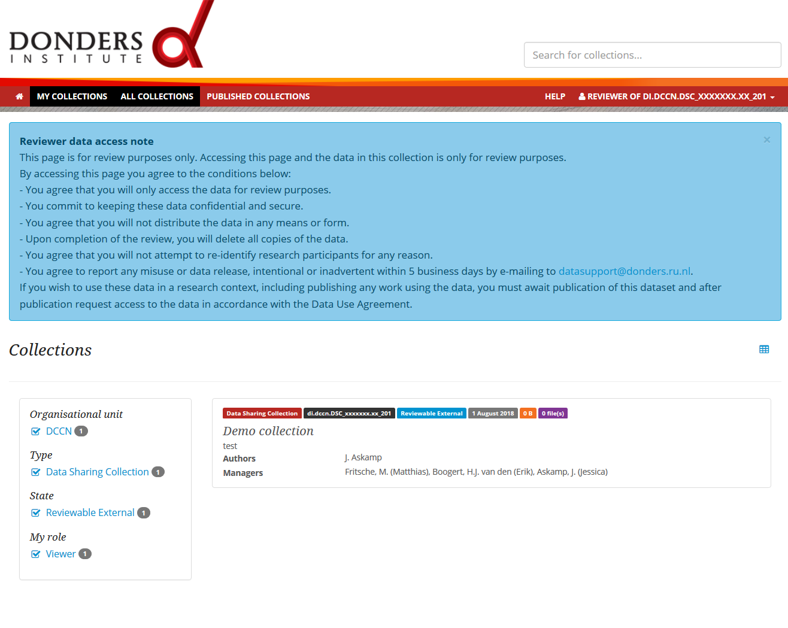

.. _reviewer-access:

Reviewer access
===============

When submitting a manuscript to a journal, the editor of the journal may already request access to shared data. However, before acceptance of the manuscript, the content of the Data Sharing Collection may not be definite yet and therefore the Data Sharing Collection should not be published yet.  

To allow the journal editor to access a Data Sharing Collection that is not yet published, the editor can be provided with the 'reviewer access link', see :ref:`'Publish Data Sharing Collection and share data' <publish-dsc-share-data>`. 

As an editor, you can share the 'reviewer access URL' (only) with the reviewers. The reviewers can then anonymously access and download the data collection. 

The reviewer access URL will lead you to the Data Sharing Collection page on the `Donders Repository webportal <https://data.donders.ru.nl>`_:

.. note::
    Access through the reviewer access URL is only for review purposes. By accessing, the user agrees to the conditions shown on the data collection page (see above). Once the collection is published, one must request access to the data in accordance with the :ref:`Data Use Agreement <faq-data-use-agreement>`.

As a reviewer, you can download the data of the collection by following the instruction in :ref:`Transfer data <transfer-data>`.