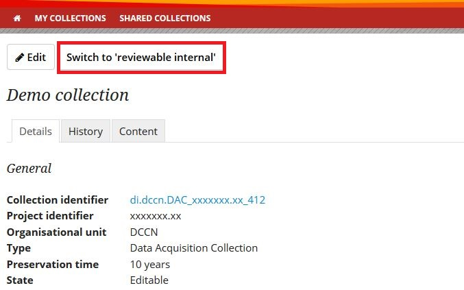
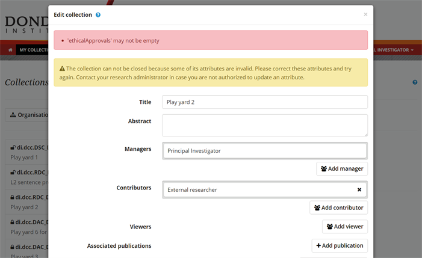
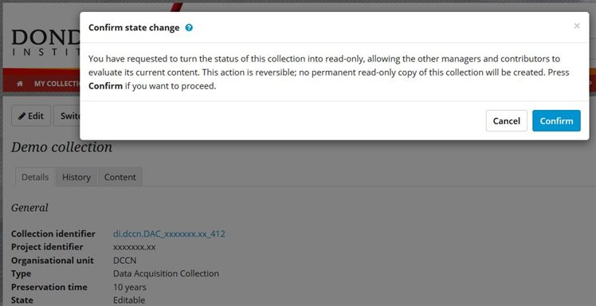
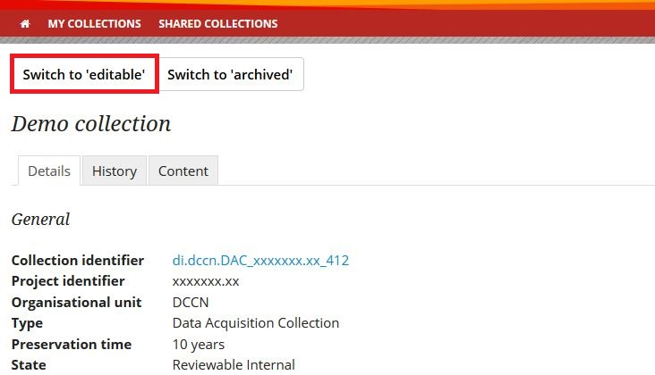
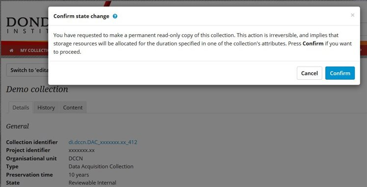

.. _archive-dac-rdc:

Archive DAC and RDC
===================

When a research project is completed, the associated :ref:`Data Acquisition Collection (DAC) and/or Research Documentation Collection <faq-collection-types>` should be archived.

.. note:: 

    Only the manager of a collection can archive a collection.

To archive a DAC or a RDC, log in to the portal :ref:`(see 1.1) <login-portal>` on your collections page, select the collection you want to archive, and click the button "switch to reviewable internal". This updates the status of the collection to a 'read-only' state that allows colleagues to review its content before archiving.

Details of the collection have to be specified :ref:`see 1.2 <edit-your-collection-details>` before the collection can be archived. The system will give you an error message if some required information is missing. In the example below, the information about the ethical approval is missing.

A collection can be archived if all the required details are specified. Then you can confirm the switch to "reviewable internal".

Now, the status of the current collection is switched from "editable" to "reviewable internal". In this state, the collection is read-only. However, this state is reversible: you can still switch it back to "editable".

This is the state in which you should ask all your collaborators to check whether all the data, scripts etc. are complete. If this is not the case, then you can change the collection's status back to editable by clicking "switch to editable".

If all collaborators agree that the collection is complete, click "switch to archived" and confirm the state change.

.. note::

    Keep in mind that this step is irreversible!

Now the status of the collection is changed from 'reviewable internal' to 'archived'. A permanent read-only copy of the collection is created. The read-only copy acquires a version number that can be used for future reference.

At the end of the details of this collection you will see the version details.

Go to next section :ref:`Publish Data Sharing Collection (DSC) and share data <publish-dsc-share-data>`
