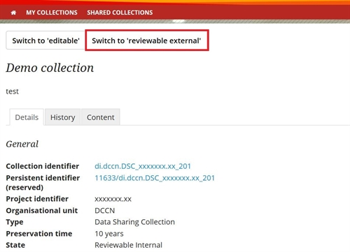
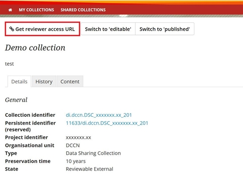
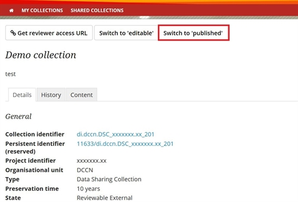

.. _publish-dsc-share-data:

Publish DSC and share data
==========================

To share your research data with researchers other than your collaborators you can use a :ref:`Data Sharing Collection <faq-collection-types>` (DSC) (see this FAQ: :ref:`Which files should and should I not upload to a DSC? <faq-dsc-files>`.

A DSC should be published together with the publication of the manuscript. Similar to the publication process in scientific journals, the DSC can follow an internal and external review process before being published.

.. note::

    Please note that only the manager of a collection can publish a collection.

By publishing a DSC, your research data are made publicly available. If you do not want to share your data immediately (e.g. if you are still working on follow up publications based on the same data), you should share the data under an embargo period of a certain time. In the embargo period the published DSC is visible on the web portal with a subset of the collection details. However, the access to its data content will not be publicly available. The embargo period can only be set by the research administrator. Therefore, when requesting a DSC :ref:`(see this FAQ) <faq-how-to-request-collection>` make sure you specify the embargo period.

When publishing the DSC, you also need to select your "data use agreement" :ref:`(see this FAQ) <faq-data-use-agreement>`

To publish a DSC, you must initially follow the same internal review procedure as described for archiving a :ref:`Data Acquisition Collection (DAC) or a Research Documentation Collection (RDC)<archive-dac-rdc>`.

If all collaborators agree on the content of the collection, you may want or be requested to allow external reviewers to access your DSC before publishing it.

When the status of the current DSC is "reviewable internal", you can change its status to "reviewable external" by clicking the button and confirming the state change. In this state, the collection is still read-only.

A collection-specific URL is available specifically for external reviewers to access your collection. This URL should only be shared with the editor of the journal to which you send your manuscript. You can retrieve the URL by clicking the "get reviewer access URL" button. Any reviewer that uses the link is added to the DSC having the same rights a viewer has.

When sharing the URL with the journal editor, make sure to include a small explanation about how to access the repository and download data. Here's a template e-mail that you can use for that:

::

    The reviewable data for paper XXX-YYY can be found via the following URL: https://data.donders.ru.nl/login/reviewer-CollectionSpecificURL (replace CollectionSpecificURL by the string that you copy and paste when clicking the "get reviewer access" button). The URL provided should only be shared with reviewers. The data will only be publicly available after manuscript acceptance, in which case the persistent identifier that is currently reserved for this collection will become effective.

By following the URL, reviewers can view the data sharing collection in their web-browser and can download the collection content according to the instructions found at :ref:`access shared data <access-shared-data>`.

After external review, the DSC may require changes. This can be done by making the DSC editable again (click button "switch to editable"). The internal and external review process for the data publication can be repeated if required.

When the manuscript is accepted for publication, the Data Sharing Collection should be published by changing its state from "reviewable external" to "published" by clicking the "switch to published" button.

.. note::
    
    Keep in mind that this step is irreversible!

After the collection is published a permanent read-only copy of the collection will be created and a :ref:`persistent identifier <faq-persistent-identifier>` will be assigned. The persistent identifier can be used for future references.

A few details of a DSC can still be changed after it has been published, e.g., linking publications to it.

