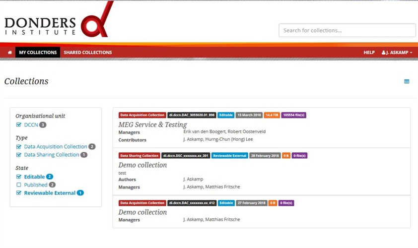
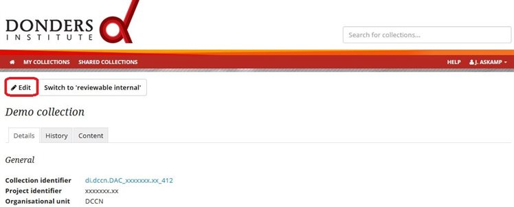
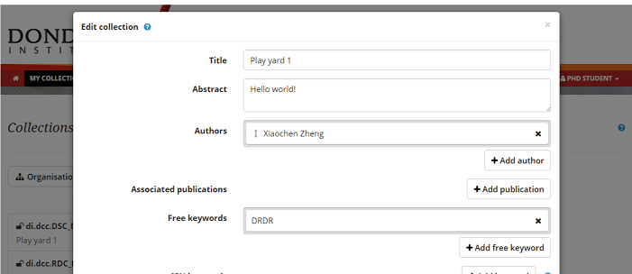

.. _edit-your-collection-details:

Edit your collection details
============================

Once you are logged in to the portal, you are directed to the Collections page.

Under *My collections* you can find all collections in which you have a role (see these FAQs: :ref:`What are the differences between the roles in a collection? <faq-differences-between-roles>` and :ref:`How do I request the different collections? <faq-how-to-request-collection>`.

Here you can filter your collections according to:

- :ref:`Organisational unit <faq-organisational-unit>`
- :ref:`Collection type <faq-collection-types>`
- Collection state

To review the details of a collection (e.g. title, :ref:`abstract <faq-abstract>`, :ref:`authors <faq-authors>`, keywords :ref:`SfN <faq-keyword-SfN>` or :ref:`MeSH <faq-keyword-MeSH>`, :ref:`ethical approvals <faq-ethical-approval-human-data>`), click on the collection.

.. note::

    - If you are a viewer of a collection, you cannot edit its details.
    - If you are a viewer and want to access the data of the collection, please continue reading section :ref:`access-shared-data`.

To edit the details of a collection, click on the *Edit metadata* button.

Depending on your role (see this FAQ: :ref:`What are the differences between the different roles in a collection <faq-differences-between-roles>`) in the collection, the edit dialog allows you to:

- specify the details of a collection
- specify who can modify and/or access the collection (manager, contributor, viewer)
- link the collection to associated publications (e.g. in PubMed)
- link the collection to associated collections in the repository

.. note::

    Consider carefully whether you want to add someone else as a manager to the collection. All managers share the responsibility for the collection and have the same rights. This also means that one manager can remove another manager from the collection (see this FAQ: :ref:`Who can be assigned to the different roles? <faq-who-can-be-assigned-to-roles>`).

For more information about the collection details that you can edit, click the questionmark icon.

.. note::

    If you want to share your data with specific collaborators, invite them to log in to the repository and subsequently add them as contributors or as viewers. If you want to share the data with the public, go to :ref:`publish-dsc-share-data`.
