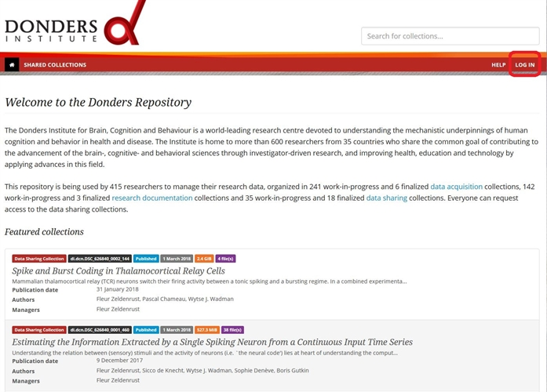
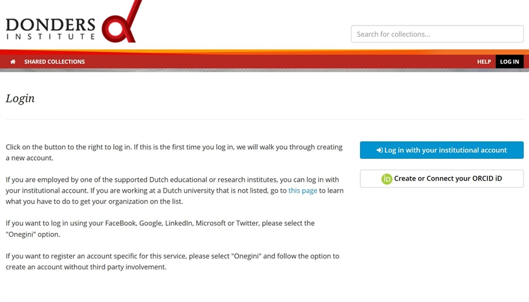
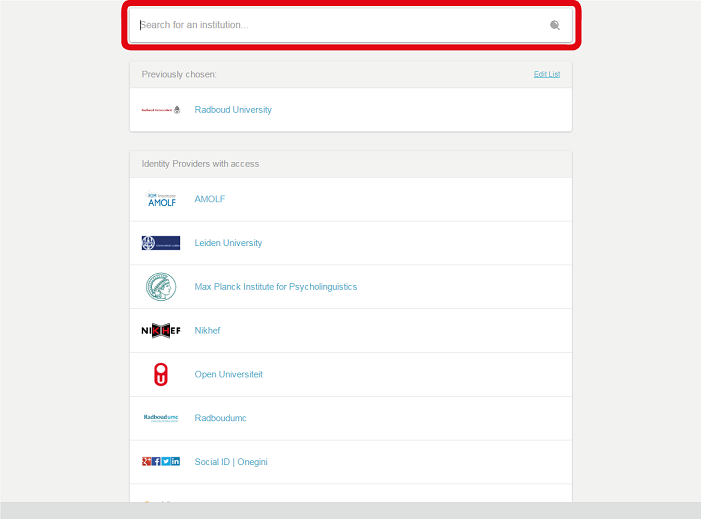
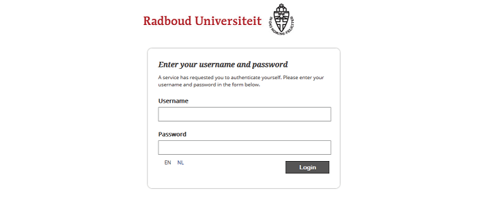
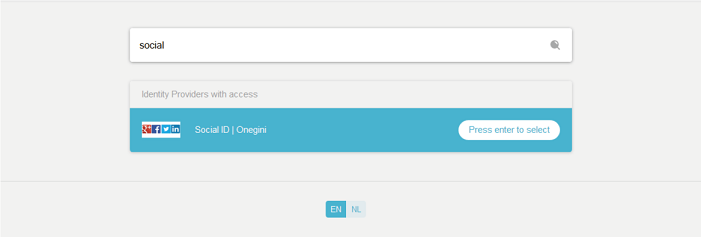
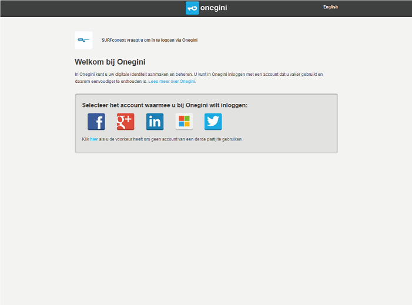

.. _login-portal:

Login in Portal
===============

If you want to see the details of a collection, or make changes to open collections, click the *LOG IN* button on `the Data Repository homepage <https://data.donders.ru.nl>`_. Without logging in you will only be able to see limited information of published data sharing collections.

On the login page you can choose either your institutional account or ORCID-ID. How you login will determine to which role in a collection you can be authorized, see :ref:`this FAQ <faq-get-started>`.

Preferably use your home institution account to login. To do this, search for your institute in the list.

Fill in your username and password of the user account from your home institute. For the Radboud University this would be your u-number, for the RadboudUMC this would be your z-number.

.. note::

    If your institute is not listed, then it can be added by the :ref:`SURFconext <faq-surfconext>` contact person of your institute. See this :ref:`FAQ <faq-surfconext-add-institute>` for instructions.

In case you do not have an institutional account, you can log in using the *Social ID | Onegini* option. This allows you to use your Google, LinkedIn, Facebook or Twitter account. Please keep in mind that with a Social ID you can only access published :ref:`Data Sharing Collection (DSC) <faq-dsc>`. Read more on the Onegini option in this :ref:`FAQ <faq-onegini>`.

Choose the social account that you would like to use. Then you can use the username and the password of that social account to login.

Alternatively, (create and) use ORCID-iD to login to the Donders Repository. This is recommended when sharing data with researchers who do not have an institutional account supported by SURFconext but do require authorization to add/modify/delete data. To allow logging into the repository with your ORCID-iD, you must allow at least 'trusted parties' to be able to see your e-mail address (see email settings on the webpage https://orcid.org/).

Common questions
----------------

- :ref:`In my browser I cannot select any institution. What should I do? <faq-surfconext-add-institute>`
- :ref:`Can I have multiple user profiles in the repository? <faq-multiple-user-profiles>`
