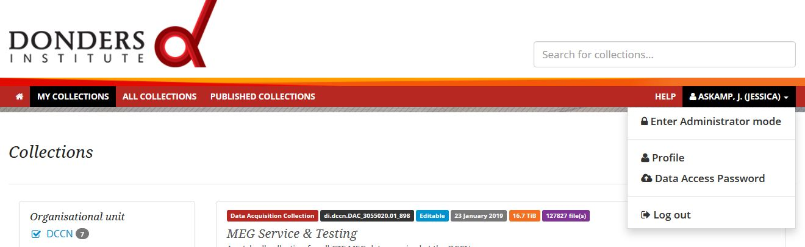
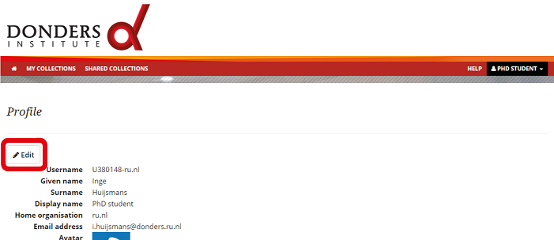
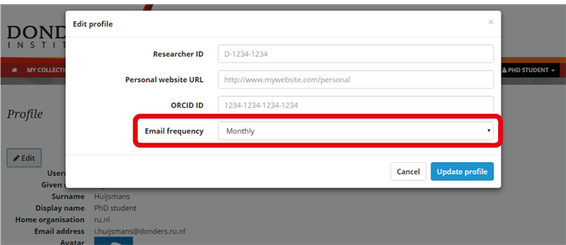

.. _receive-email-notifications:

Receive email notifications
===========================

The repository can notify you regularly about your collections and changes that were made by your collaborators. To enable this or to change the frequency with which email notifications are sent, click on the *Profile* that appears in the drop-down menu under your name.

Click on the *Edit* button.

You can adjust the frequency of email notifications. By default this is set to "Monthly".

