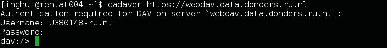
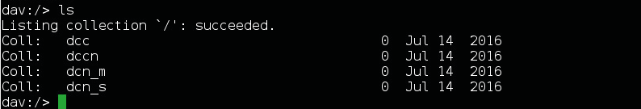
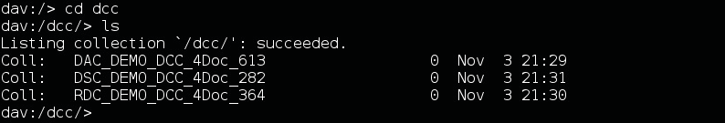
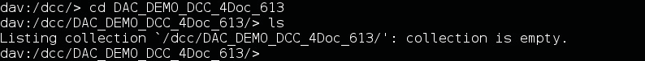
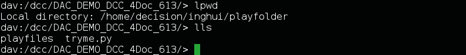
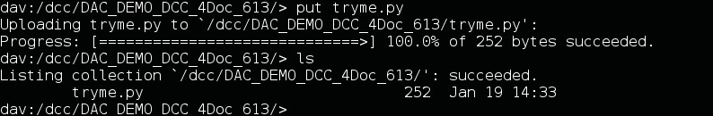
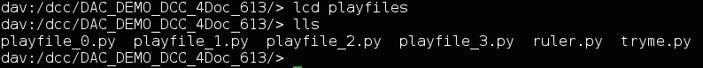
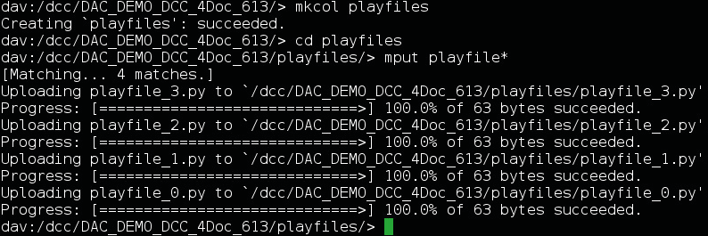
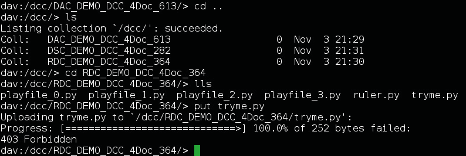
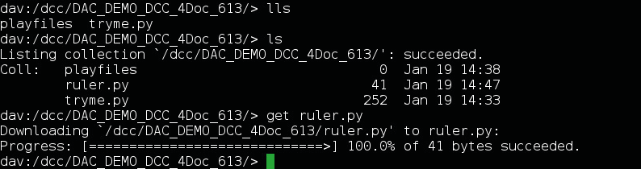

.. _cadaver:

Cadaver
=======

For Linux users who don't work with a graphical desktop environment, the recommended command-line tool is Cadaver.

Install cadaver
---------------

For help installing Cadaver on your Linux device please contact datasupport@donders.ru.nl.

Start with cadaver
------------------

The following section will demonstrate how to transfer files to the repository using Cadaver. Find a command reference for Cadaver :ref:`here <cadaver_command_reference>`.

Open the Linux terminal and type the following command.

.. code-block:: bash

    $ cadaver https://webdav.data.donders.ru.nl

You will be asked to provide the *username* (CASE SENSITIVE!) and *password* of your :ref:`data access account <data-access-account>`.

Navigating local and remote directories
---------------------------------------

Once you login to the WebDAV service, you are in the root directory. It allows you to navigate to the different Donders Institute organizational units. Type the following command to list the content of the current collection.

.. code-block:: bash

    $ ls

This example will load files to a collection from the organizational unit DCC.

In the subtree of a particular organizational unit, you will see the directories of all its collections. You can only see these collections if you are authorized (i.e., if you are a viewer, contributor or manager of the corresponding collection). As a viewer of a collection, you are only allowed to download data from that collection. As a contributor or manager, you are also allowed to upload and modify data.

Change directory to the DCC and list the collections available for the user in this example.

.. code-block:: bash

    $ cd dcc
    $ ls

Change directory to the DAC and list the content of the DAC.

.. code-block:: bash

    $ cd DAC_DEMO_DCC_4Doc_613
    $ ls

The DSC is still empty, let&rsquo;s upload a first file. The following commands will display the current local directory and list files and folders in it.

.. code-block:: bash

    $ lpwd
    $ lls

Now let's upload the file `tryme.py` to the DAC

.. code-block:: bash

    $ put tryme.py
    $ ls

In the local folder `playfiles` there are four files. Here we navigate to that folder and list its contents:

.. code-block:: bash

    $ lcd playfiles
    $ lls

The following commands will create a new folder in the DAC and upload the four files at the same time.

.. code-block:: bash

    $ mkcol playfiles
    $ cd playfiles
    $ mput playfile*

In the Command list below, we list more commands that show you e.g. how to delete folders and files from the DAC. If you try to upload files to a directory for which you are not authorized (i.e., you are not a contributor or manager of the corresponding collection), you will get an Internal Server Error. Below, we give an example that was obtained by trying to upload the file tryme.py to the collection RDC_Demo_4Doc_364, in which you only have the viewer role.

As last example we show you how to download a file with the command get.

.. include:: readmore.rst

.. _cadaver_command_reference:

Command list
------------

.. rst-class:: table table-bordered table-striped

+-------------------------------------------+----------------------------------------------------------+
| **Command**                               | **Function**                                             |
+===========================================+==========================================================+
| help [*command*]                          | Display help message of a cadaver *command*.             |
+-------------------------------------------+----------------------------------------------------------+
| cadaver https://webdav.data.donders.ru.nl | Log into the WebDAV server.                              |
+-------------------------------------------+----------------------------------------------------------+
| cd [*path*]                               | Change working collection referred by *path*             |
+-------------------------------------------+----------------------------------------------------------+
| lcd [*path*]                              | Change local working directory referred by *path*.       |
+-------------------------------------------+----------------------------------------------------------+
| ls [*path*]                               | List contents in current or other collection by *path*.  |
+-------------------------------------------+----------------------------------------------------------+
| lls [*options*]                           | Display local directory listing.                         |
+-------------------------------------------+----------------------------------------------------------+
| pwd                                       | Display name of current collection.                      |
+-------------------------------------------+----------------------------------------------------------+
| put *local* [*remote*]                    | Upload *local* file to *remote* resource.                |
+-------------------------------------------+----------------------------------------------------------+
| get *remote* [*local*]                    | Download *remote* resource to *local* file.              |
+-------------------------------------------+----------------------------------------------------------+
| mget *remote*                             | Download many *remote* resources.                        |
+-------------------------------------------+----------------------------------------------------------+
| mput *local*                              | Upload many *local* files.                               |
+-------------------------------------------+----------------------------------------------------------+
| edit *remote*                             | Edit *remote* resource.                                  |
+-------------------------------------------+----------------------------------------------------------+
| mkcol *remote*                            | Create *remote* collection.                              |
+-------------------------------------------+----------------------------------------------------------+
| cat *remote*                              | Display *remote* resource(s).                            |
+-------------------------------------------+----------------------------------------------------------+
| delete *remote*                           | Delete *remote* non-collection resource.                 |
+-------------------------------------------+----------------------------------------------------------+
| rmcol *remote*                            | Delete *remote* collection.                              |
+-------------------------------------------+----------------------------------------------------------+
| copy *source...* *destination*            | Copy resource(s) to *destination*.                       |
+-------------------------------------------+----------------------------------------------------------+
| move *source...* *destination*            | Move resource(s) to *destination*.                       |
+-------------------------------------------+----------------------------------------------------------+
| close                                     | Close current connection.                                |
+-------------------------------------------+----------------------------------------------------------+
| quit                                      | Exit program.                                            |
+-------------------------------------------+----------------------------------------------------------+
| logout                                    | Logout current authenticated session.                    |
+-------------------------------------------+----------------------------------------------------------+
