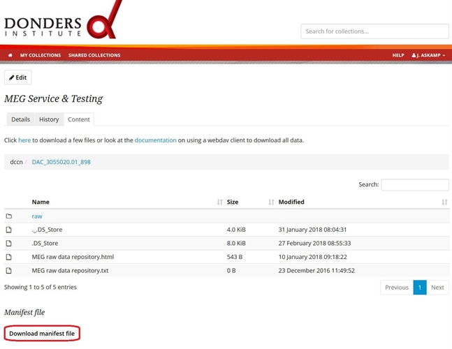

.. _check-transferred-data:

Check transferred data
======================

After transferring files (uploading or downloading) between the repository and your computer you need to make sure all the files are transferred completely. Especially when transferring a large number of files and/or large files, something can go wrong along the way (e.g., short interruption in the network connection, unexpected downtime of the server, etc.).

To check the presence (i.e. the number) and the content of the files, you can use the *manifest file* for the collection. This contains a list of all files with a checksum for each. You can download the manifest file from the manifest tab on the collection's page.

After downloading the manifest file, move it to the folder on your computer that contains the local copy of the files from the repository.

The subsequent instructions depend on your computer's operating system. Choose the appropriate option.

#. :ref:`Windows <check-transferred-data-windows>`
#. :ref:`Linux and Mac OSX <check-transferred-data-linux>`

Common problems:

- :ref:`Why are there files without checksum in the manifest file? <faq-files-without-checksum>`
- :ref:`It took very long time to download the manifest file; and eventually failed with the "504 Gateway Time-out" error. What should I do? <faq-download-manifest-timeout>`

.. _check-transferred-data-windows:

Windows
--------

#.  Download the Hashcheck tool

    Go to https://github.com/gurnec/HashCheck/releases/tag/v2.4.0 and download the file: `HashCheckSetup-v2.4.0.exe`.

    .. figure:: images/cs_1.png

    Run the executable file (`HashCheckSetup-v2.4.0.exe`) and install the Hashcheck tool (you need administrator rights of the computer for this). Restart your computer after the installation.

    .. figure:: images/cs_2.png

Hashcheck only needs to be installed once; after installation, you can use it for all your future file transferring.

#.  Change the manifest file's extension from `.txt` to `.sha256`

    After this change of the extension, Windows will open the file with HashCheck instead of Notepad when double-clicking on it.

    If the file extensions are not visible, go to the start menu of your computer, search for *Folder options* and select the top option - *Folder options.*; Select *View* on the top menu. Remove the tick from *Hide extensions for known file types*. Click on *OK*.

#.  Check for correct file transferred

    Double-click on the manifest file to open the HashCheck application. This will open a window that lists the files that are matched and non-matched. Note that computing the checksum can take some time, especially if there are many and/or large files.

.. _check-transferred-data-linux:

Linux/Mac OSX
-------------

Open the command window/terminal and change directory to folder that contains the local copy of the files from the repository.

.. code-block:: bash

    $ cd ~/Download/MyCollectionName

in which `MyCollectionName` is the name of the folder on your local computer that must contain the same files as the collection in the repository.

#.  Check the success of file transferred

    For Linux check the success of transferring process with the sha256sum command:

    .. code-block:: bash

        $ sha256sum -c ~/Download/ManifestFile.txt

    Most linux distributions come with the sha256sum utility. If sha256sum is not installed on your computer, you can do:

    .. code-block:: bash

        $ apt-get install coreutils

    for Debian and Ubuntu-based distributions, or

    .. code-block:: bash

        $ yum install coreutils

    for RedHat, Fedora and CentOS-based distributions.

    For Mac OS-X check the success of transferring process with the shasum command:

    .. code-block:: bash

        $ shasum -a 256 -c ~/Download/ManifestFile.txt

    If shasum is not installed on your system, you can use Homebrew to install it. See http://brew.sh for details.

    In these commands `ManifestFile` is the name of the manifest file downloaded from the repository. This reports the matched and non-matched files within the collection directory

    To see only the names of the non-matched files, use the following command:

    .. code-block:: bash

        $ shasum -a 256 -c ~/Download/ManifestFile.txt | grep -v 'OK'