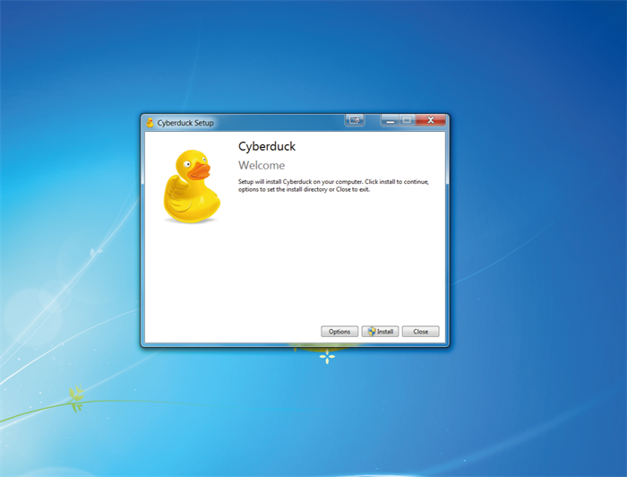
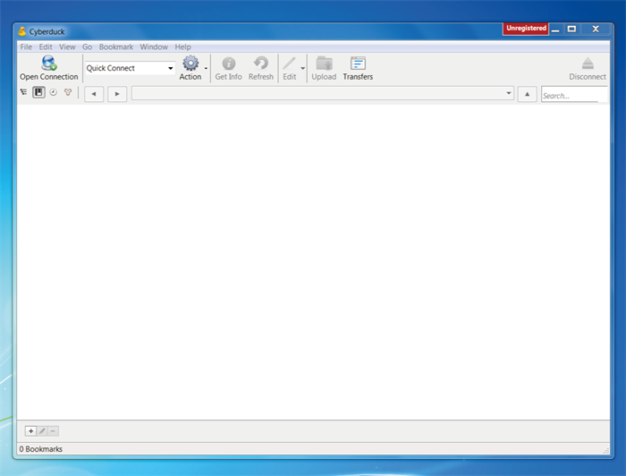
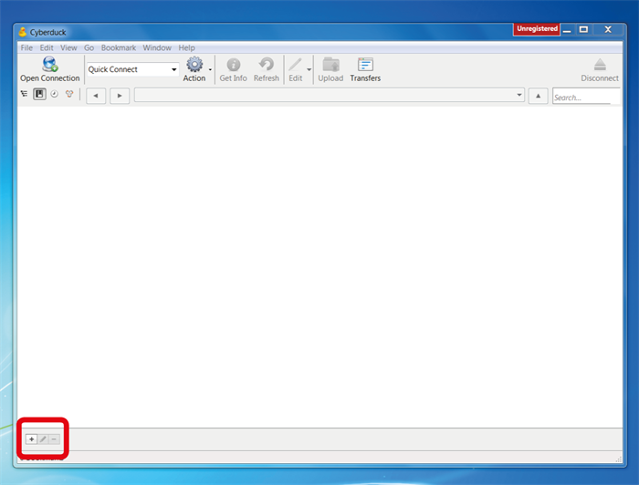
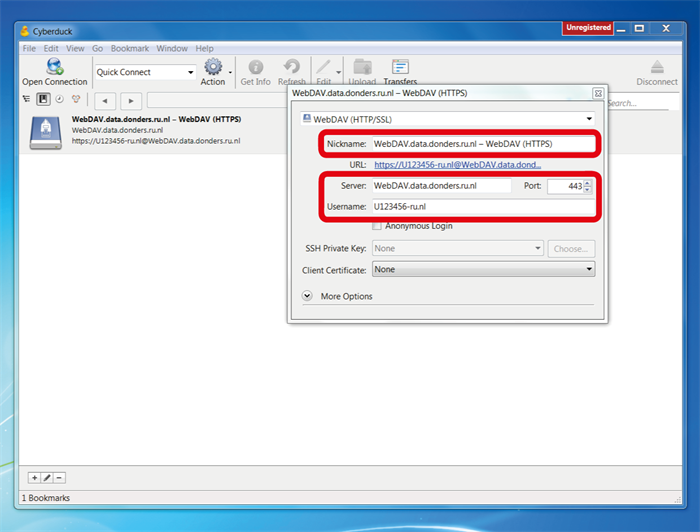
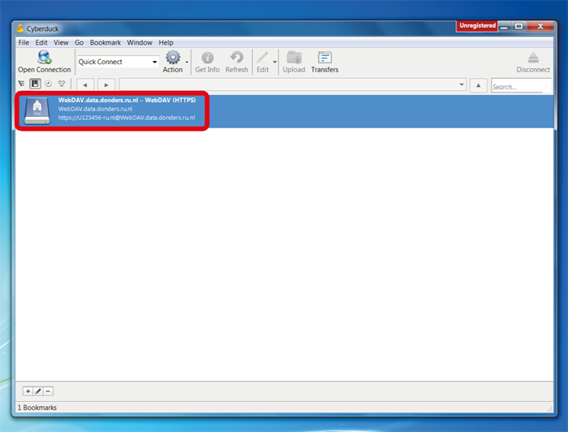
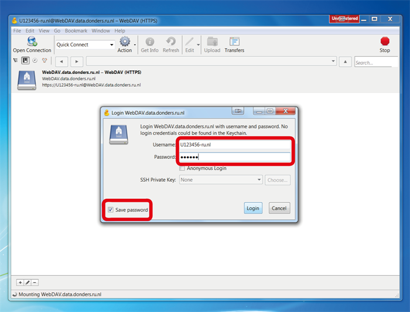
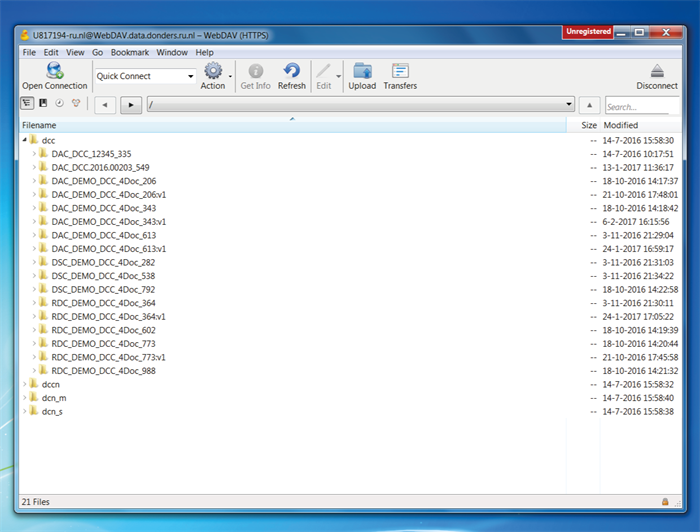
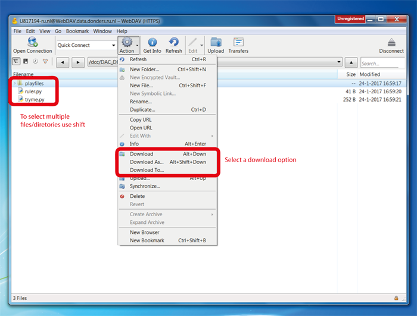
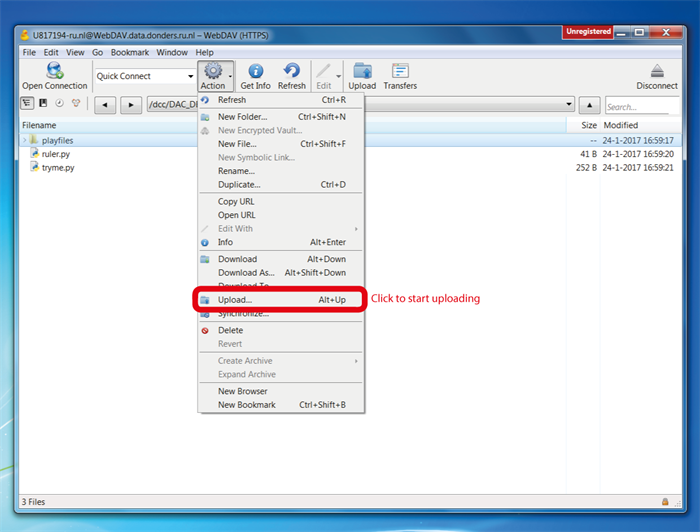
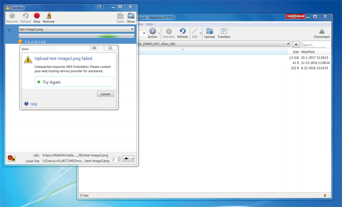

.. _cyberduck:

Cyberduck
=========

For Windows and MacOSX users, the recommended WebDAV client is Cyberduck.

*Please do not use older versions of Cyberduck than version 4.8.4. Cyberduck interface for MacOSX is very similar so it will not be described separately.*

Install Cyberduck
-----------------

Download the installer from software's website and follow instructions step-by-step while executing the installer. You need administrator rights to install Cyberduck software on your computer.

Start with cyberduck
--------------------

When you open Cyberduck after installation, the interface looks like this:

To view, upload and download files you need to create a new bookmark. Click on the &ldquo;+&rdquo; sign to create a new bookmark.

A new pop-up window will appear. In this window you must configure the bookmark as follows:

- **WebDAV (HTTP/SSL)**
- **Nickname: add a freely chosen nicknam to the new connection**
- Server: **webdav.data.donders.ru.nl**
- Port: **443**
- Username: the *username* (CASE SENSITIVE!) of the :ref:`data access account <data-access-account>`

The configurations are saved to the bookmark automatically. Just close the configuration window when you are done.

Double-click on the saved bookmark to make connection.

You will be asked to provide the username and password of your :ref:`data access account <data-access-account>` (Attention: here you need the one-time password, not the same password for your institute account!) to login window of Cyberduck. In that window, make sure you tick the option Save password (MacOSX: "Add to Keychain").

Transferring Data
-----------------

After your login, you will see four directories: one for each organizational unit of the Donders Institute.

In the subtree of a particular organizational unit, you will see directories of collections in which you are authorized for data access (i.e., you are a viewer, contributor or manager of the corresponding collection). As a viewer of a collection, you are only allowed to download data from that collection. As a contributor or manager, you are also allowed to upload and modify data.

After entering a collection's directory you can download data by selecting files/directories followed by clicking the &ldquo;Action&rdquo; button on the menu bar. In the drop-down menu, choose one of the download options and follow the dialog to save them locally.

Upload a file/directory by selecting the Action button on the menu bar. A dialog window will pop-up for you to select local files to upload. See the screenshot below:

.. note::

   If the WebDAV client (i.e. Cyberduck) is inactive for two hours (e.g. no browsing or data transfer activities), you will be logged out automatically by the WebDAV server. In this case, you will have to login again with a fresh one-time password.

If you try to upload files to a directory for which you are not authorized (i.e., you are not a contributor or manager of the corresponding collection), you will get an Internal Server Error message similar to the screenshot below.

Read more about the content of collections
------------------------------------------

- What files should I upload in different collections? Read the FAQ about files in the Data Aquisition Collection (:ref:`DAC <faq-dac-files>`), Research Documentation Collection (:ref:`RDC <faq-rdc-files>`) and Data Sharing Collection (:ref:`DSC <faq-dsc-files>`)?
- How should I organize my data? Read the FAQ about organizing data in a :ref:`DAC <faq-dac-organisation>` and :ref:`RDC <faq-rdc-organisation>`?
- :ref:`Where should I store personal information about the participants? <faq-where-store-personal-information>`
- :ref:`How to refer to data that the researcher did not collect? <faq-refer-data-not-collected-by-researcher>`
- :ref:`How should I document the experimental setup? <faq-document-experimental-setup>`
