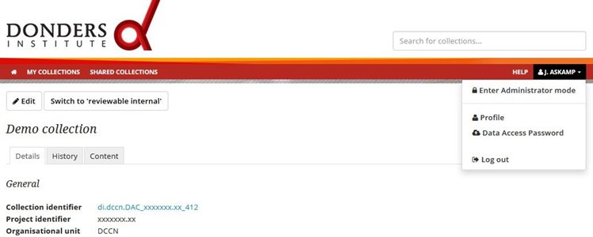
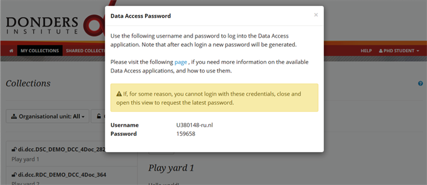

.. _data-access-account:

Data access account
===================

In order to upload, download or view the content of files, you need a one-time data access password.

To get the data access password you first must login (Read: :ref:`How to login? <login-portal>`) in the portal (ttps://data.donders.ru.nl). After logging in, click on your display name at the top-right corner to open a drop-down menu, and select *Data Access Password*.

Your *username* and the *one-time password* for data-access will be displayed on the pop-up window. The username is a combination of the user ID and the home organization. **Note that your username is case sensitive**. The password is valid for 72 hours. If the password has expired, you can simply repeat this procedure.

Now that you have the data transfer username and one time password, you can use one of the following methods to transfer files and directories:

- :ref:`Mount as network drive <mount-network-drive>`
- :ref:`Cyberduck <cyberduck>`
- :ref:`Thunar <thunar>`
- :ref:`Cadaver <cadaver>`
