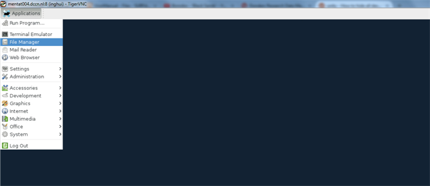
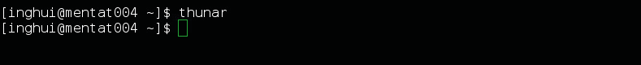
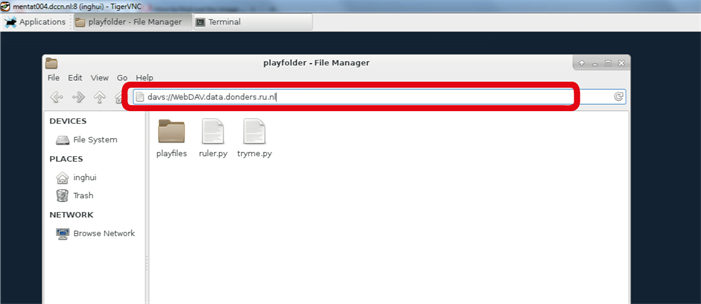
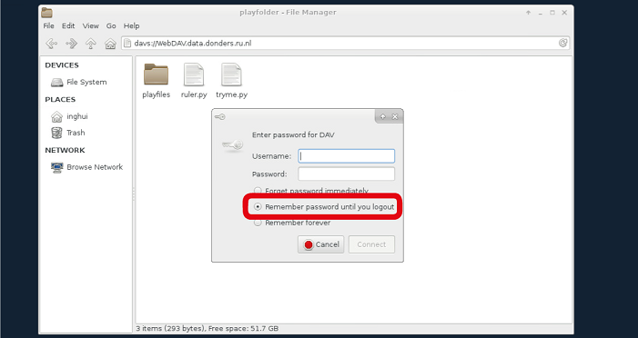

.. _thunar:

Thunar
======

For Linux users, the Thunar file manager of XFCE (a Linux windows manager) is the recommended GUI WebDAV client.

Install thunar
--------------

The Thunar file manager is integrated with the XFCE windows manager. To install XFCE, the super user permission on your Linux device is required. For further help please contact datasupport@donders.ru.nl.

Start with thunar
-----------------

In the XFCE windows manager, start the *File Manager* application from the *Application Menu*.

Alternatively, you could also open the Thunar file manager with the command in a text terminal.

.. code-block:: bash

    $ thunar

A file manager window will appear. In the browser bar at the top, type the following address: `davs://WebDAV.data.donders.ru.nl`.

You will be asked to provide the *username* (CASE SENSITIVE!) and *password* of your :ref:`data access account <data-access-account>` to login. Before you click the *Connect* button, make sure the item **Remember password until you logout** is ticked.

Transfer data
-------------

After you logged in, you will see four directories: one for each Donders Institute organizational unit. On the left side you see that a new network connection has been made. You can use this to navigate to the repository.

.. figure:: images/thunar-navigate.png

In the subtree of a particular organizational unit, you will see the directories of all its collections. You can only see these collections if you are authorized (i.e., if you are a viewer, contributor or manager of the corresponding collection). As a viewer of a collection, you are only allowed to download data from that collection. As a contributor or manager, you are also allowed to upload and modify data.

You can now copy/paste or drag and drop files from and to your preferred local directory.

.. include:: readmore.rst
